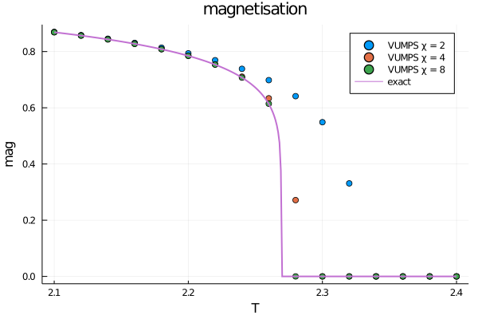
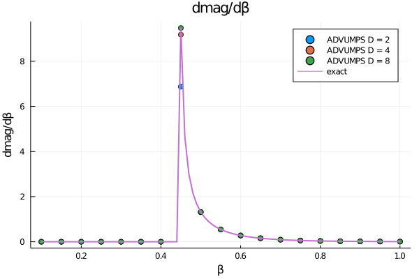
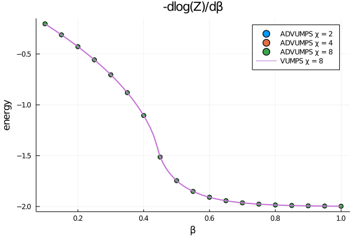

# ADVUMPS.jl

[](https://travis-ci.com/XingyuZhang2018/ADVUMPS.jl)
[](https://codecov.io/gh/XingyuZhang2018/ADVUMPS.jl)

This is a julia package to realise Automatic Differential(AD) for Variational Uniform Matrix product states(VUMPS). 

In this package we implemented the algorithms described in [Differentiable Programming Tensor Networks](https://arxiv.org/abs/1903.09650), but in another contraction method namely VUMPS.
demonstrating two applications:
- Gradient based optimization of iPEPS
- Direct calculation of energy densities in iPEPS via derivatives of the _free energy_

The key point to implement AD for VUMPS is to get adjoint of eigsolve, which have been solved in [Automatic differentiation of dominant eigensolver and its applications in quantum physics](https://journals.aps.org/prb/abstract/10.1103/PhysRevB.101.245139).

This package used [TensorNetworkAD.jl](https://github.com/under-Peter/TensorNetworkAD.jl) for reference.
## install
```shell
> git clone https://github.com/XingyuZhang2018/ADVUMPS
```
move to the file and run `julia REPL`, press `]` into `Pkg REPL`
```julia
(@v1.6) pkg> activate .
Activating environment at `..\ADVUMPS\Project.toml`

(ADVUMPS) pkg> instantiate
```
To get back to the Julia REPL, press `backspace` or `ctrl+C`. Then Precompile `ADVUMPS`
```julia
julia> using ADVUMPS
[ Info: Precompiling ADVUMPS [1846a12a-bf3c-41d7-8528-153c1dad55cd]
```
## Example
If you want to learn deeply into this package, I highly recommend to run each single test in `/test/runtests` in sequence.
### Free Energy of the 2D Classical Ising Model

We start by constructing the tensor for the tensor network representation of the 2d classical Ising Model.
This tensor can be constructed using the `model_tensor`-function that takes a `model`-parameter - in our case `Ising()` - and an inverse temperature `β` (e.g. at `β=0.5`).

```julia
julia> a = model_tensor(Ising(), 0.5)
2×2×2×2 Array{Float64,4}:
[:, :, 1, 1] =
 2.53434  0.5    
 0.5      0.18394

[:, :, 2, 1] =
 0.5      0.18394
 0.18394  0.5    

[:, :, 1, 2] =
 0.5      0.18394
 0.18394  0.5    

[:, :, 2, 2] =
 0.18394  0.5    
 0.5      2.53434
```
Then get VUMPS environment using the `vumps_env`-function that takes a `model`-parameter (in our case `Ising()`), an inverse temperature `β` (e.g. at `β=0.5`) and environment tenosr non-physical index dimension `D` (e.g. `D=2`)
```julia
julia> env = vumps_env(Ising(),0.5,2; verbose=true);
vumps environment load from ./data/Ising()_β0.5_D2.jld2 -> vumps done@step: 14, error=4.711261292584041e-11

julia> typeof(env)
SquareVUMPSRuntime{Float64, Array{Float64, 4}, Array{Float64, 3}, Matrix{Float64}} (alias for VUMPSRuntime{SquareLattice, Float64, 4, Array{Float64, 4}, Array{Float64, 3}, Array{Float64, 2}})
```
Using the `Z` function, we can calculate the partition function of the model per site:
```
julia> Z(env)
2.7893001925286596
```
Given the partition function, we get the free energy as the first derivative with respect to `β` times `-1`.
With Zygote, this is straightforward to calculate:
```julia

julia> e = β -> -log(Z(vumps_env(Ising(),β,2;verbose=true)))
#1 (generic function with 1 method)

julia> using Zygote

julia> Zygote.gradient(e,0.5)[1]
random initial vumps environment-> vumps done@step: 14, error=7.015494617183392e-11
-1.7456736441068634
```
more result is ploted by `/plot/2Dising.jl`

<div align="center"></div>

### Finding the Ground State of infinite 2D Heisenberg model

The other algorithm variationally minimizes the energy of a Heisenberg model on a two-dimensional infinite lattice using a form of gradient descent.

First, we need the hamiltonian as a tensor network operator
```
julia> h = hamiltonian(Heisenberg())
2×2×2×2 Array{Float64,4}:
[:, :, 1, 1] =
 -0.5  0.0
  0.0  0.5

[:, :, 2, 1] =
  0.0  0.0
 -1.0  0.0

[:, :, 1, 2] =
 0.0  -1.0
 0.0   0.0

[:, :, 2, 2] =
 0.5   0.0
 0.0  -0.5
```
where we get the `Heisenberg`-hamiltonian with default parameters `Jx = Jy = Jz = 1.0`.
Next we initialize an ipeps-tensor and calculate the energy of that tensor and the hamiltonian:
```julia
julia> ipeps, key = init_ipeps(Heisenberg(); D=2, χ=4, tol=1e-10, maxiter=20);
random initial iPEPS

julia> energy(h, ipeps; χ=4, tol=1e-6, maxiter=20, verbose=true)
random initial vumps environment-> vumps done@step: 2, error=6.94111999566797e-9
-0.5078455484333437
```
where the initial energy is random.

To minimise it, we combine `Optim` and `Zygote` under the hood to provide the `optimiseipeps` function. The `key` is used to save `.log` file and finial `ipeps` `.jld2` file.
```julia
julia> using Optim

julia> res = optimiseipeps(ipeps, h, key; f_tol=1e-6);
0.0s   0   -0.5078455500998766   0.05060364688493
3.26s   1   -0.6505191987941701   0.0736550809871665
4.03s   2   -0.6567482187653069   0.017897895147112403
5.04s   3   -0.6580805030493516   0.024732092984114152
6.03s   4   -0.6594054378032227   0.007716218244692543
6.95s   5   -0.6595379996856384   0.005603669830582229
7.82s   6   -0.6596841190576045   0.0041357452762833535
8.68s   7   -0.6598904216244763   0.010286981790696259
9.56s   8   -0.6601362257071041   0.0032903775514082135
10.4s   9   -0.6601685810549173   0.00048486196915701154
11.26s   10   -0.6601732531372546   0.0008126466857332753
12.41s   11   -0.6602126868029681   0.0008857679524319761
13.3s   12   -0.660223531794583   0.0006400285010753505
14.15s   13   -0.660230062772042   0.0003015152009842056
15.05s   14   -0.6602306631736168   3.7167595021814215e-5
16.17s   15   -0.6602308537997438   0.0002179292336786568
```
where our final value for the energy `e = -0.6602` agrees with the value found in the paper.

## to do 

* complex iPEPS and MPS

For complex situation `A` and `A'` are different independent variables, so must to input two variables.
